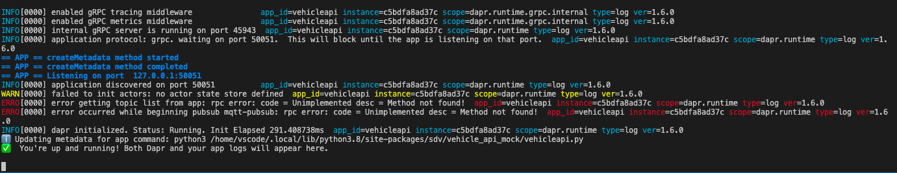

# Setup and Explore Development Environment

The following information describes how to setup and configure the Development Container (DevContainer), and how to build, customize and test the sample vehicleApp that is included in this repository. You will learn how to use the vehicleApp SDK, how to interact with the vehicle API and how to do CI/CD using the pre-configured GitHub workflows that come with the repository.

Once you have completed all steps you will have a solid understanding of the Development Workflow and you will be able to reuse this Template Repository for your own VehicleApp develpment project.

## VehicleApp Development with Visual Studio Code
Visual Studio Code [Development Containers](https://code.visualstudio.com/docs/remote/create-dev-container#:~:text=%20Create%20a%20development%20container%20%201%20Path,additional%20software%20in%20your%20dev%20container.%20More%20) allows to package a complete vehicleApp development environment including Visual Studio Code extensions, vehicleApp SDK, vehicleApp runtime and all other development & testing tools into a container that is then started within your Visual Studio Code session.

To be able to use the DevContainer, you have to make sure to fulfill the following prerequisites:

### System prerequisites
* Install Docker Engine / [Docker Desktop](https://www.docker.com/products/docker-desktop)
* Install [Visual Studio Code](https://code.visualstudio.com)
* Add [Remote-Containers](https://marketplace.visualstudio.com/items?itemName=ms-vscode-remote.remote-containers) extension via marketplace or using the command line
   ```
   code --install-extension ms-vscode-remote.remote-containers
   ```

### Proxy Configuration
> Disclaimer: Non proxy configuration is used by default

If you are working behind a corporate proxy add the following environment variable so that the DevContainer will use the correct proxy settings.

#### Windows:
1. Create an environment variable with name `DEVCONTAINER_PROXY` and with value `.Proxy` for your account
   * Don't forget (dot) in value of the environment variable
2. Restart Visual Studio Code to pick up new environment variable

#### macOS & Linux:
```
echo "export DEVCONTAINER_PROXY=.Proxy" >> ~/.bash_profile
source ~/.bash_profile
```

### Proxy Troubleshooting

If you experience issues during initial DevContainer build and you want to start over, then you want to make sure you clean all images and volumes in Docker Desktop, otherwise cache might be used. Use the Docker Desktop UI to remove all volumes and containers.

In case the DevContainer is still not working, check if proxy settings are set correctly in the `.docker\config.json` file in User profile directory, see [Docker Documentation](https://docs.docker.com/network/proxy/) for more details.

## Use Template Repository
Create your own repository copy from this Template Repository by clicking the green button `Use this template`. You don't have to include all branches.

The name `MyOrg/MyFirstVehicleApp` is used as a reference during the rest of document.

For more information on Template Repositories take a look at this [GitHub Tutorial](https://docs.github.com/en/repositories/creating-and-managing-repositories/creating-a-repository-from-a-template)

## Start VehicleApp DevContainer
With following steps you will clone and set up your development environment using the preconfigured DevContainer.

1. Start Visual Studio Code
2. Press <kbd>F1</kbd> and run the command `Remote-Containers: Clone Repository within Container Volume...`
3. Select `Clone a repository from GitHub in a Container Volume` and choose the repository / branch to clone
4. Enter the GitHub organization and repository name (e.g. `MyOrg/MyFirstVehicleApp`) and select the repository from the list
5. Select the branch to clone from the list

The first time you initialize the container it will take about 10 minutes to build the image and provision the tools inside the container.

> If the development container fails to build successfully (e.g. due to network issues) then wait for the current build to finish and then press <kbd>F1</kbd> and run the command `Remote-Containers: Rebuild Container Without Cache`

> When opening the DevContainer for the first time, a manual reload of the dapr extension is required. (Note: the reload button appears next to Dapr extension in extension menue).

## Start and test VehicleApp
Now that your DevContainer is up and running, it is time to take a look at what's inside:

* VehicleApi Mock - The API offers the endpoints of the vehicle, for development data points are mocked.
* VehicleApp - This sample app is a basic blueprint and illustrates how to interact with the VehicleApi and the VehicleApp SDK.
* Mosquitto MQTT Broker - The broker allows for interaction with other vehicleApps or the cloud and is used by the VehicleApp. The MQTT broker is running inside a docker image which is started automatically after starting the DevContainer.

There are many more tools coming with the DevContainer and you can learn more about them in the [extended Developer Documentation](dev_further_topics.md).

### Start VehicleApi Mock
Open a terminal session and start the VehicleApi mock that comes with the devContainer. Once the process is running in the background, you will be able to interact with the Vehicle API from this sample app later.

```bash
.sdv/run-vehicleapi.sh
```

You should see a new dapr-process and the VehicleApi running.


> You can ignore the "method not found!" errors.

### Start and check VehicleApp

Now that the VehicleAPI is running, let's start the sample vehicleApp to verify that you receive actual data from the API.

Open a new terminal and start the vehicleApp with the following command:
```bash
dapr run --app-id seatadjuster --app-protocol grpc --app-port 50008 --config ./.dapr/config.yaml --components-path ./.dapr/components  python3 ./src/run.py
```
Once the vehicleApp is started, you can expect to receive the current vehicle's speed, which should be reported as 0 because the vehicle has stopped.

You will see messages such as
```
== APP == datapoints {
== APP ==   id: 1
== APP ==   timestamp {
== APP ==     seconds: 1643793214
== APP ==     nanos: 24609000
== APP ==   }
== APP ==   int32_value: 0
== APP == }
== APP ==
```

To stop the vehicleApp instance: close the terminal window by hitting <kbd>Ctrl + C</kbd>.

### Debug VehicleApp

After VehicleApi and vehicleApp are running successfully, let's start a debug session for the vehicleApp as next step.

* Press <kbd>F5</kbd> to start the vehicleApp to start a debug session and see the log output on the `DEBUG CONSOLE`
* Open the main python file `src/run.py` file and set a breakpoint in `line 39`

In the next step you will use a mqtt message to trigger this breakpoint.

### Send MQTT messages to VehicleApp

Let's send a message to your VehicleApp using the mqtt broker that is running in the background.

* Make sure, Vehicle Api Mock and Seat Adjuster App are running.
* Open `VSMqtt` extension in Visual Studio Code and connect to `mosquitto (local)`
* Set `Subscribe Topic` = `seatadjuster/setPosition/response/gui-app` and click subscribe.
* Set `Publish Topic` = `seatadjuster/setPosition/request/gui-app`
* Set and publish a dummy payload:

   ```json
   {"position": 300, "requestId": "xyz"}
   ```

* Now your breakpoint in the VehicleApp gets hit and you can inspect everything in your debug session
* After resuming execution (<kbd>F5</kbd>), a response from your VehicleApp is published to the response topic
* You can see the response in the MQTT window.

## Trigger your Github Workflows
GitHub workflows are used to build the container image for the vehicleApp, run unit and integration tests, collect the test results and create a release documentation and publish the vehicleApp. A detailed description of the workflow you can find [here](https://github.com/SoftwareDefinedVehicle/sdv-velositas-docs/blob/main/docs/vehicle_app_releases.md).

Every time you commit to the repository a set of wokflows is executed automatically.


### Run GitHub Workflow
* Make modification to your file, e.g. remove the last empty line from `src/run.py`
* Commit you change
   ```bash
   git add .
   git commit -m "removed emtpy line"
   ```
* Push
   ```bash
   git push
   ```
* Open `Actions` of your github.com repository and go to [CI Workflow](../actions/workflows/ci.yml)
* Check Workflow Output, it should look like this:


## Build you first release
Now that the `CI Workflow` was successful, you are ready to build your first release. Your goal is to build a ready-to-deploy container image.

### Release the vehicleApp to push it to the container registry
* In order to deploy the vehicleApp you need to set the secrets on repository
  * Open `Settings`, go to `Secrets`, click on `Manage your environments and add repository secrets` and add the following secrets (button `Add Secret`):
    * EXTERNAL_OPS_DEFAULT_VCSS_ACR_ENDPOINT
    * EXTERNAL_OPS_DEFAULT_VCSS_ACR_USER
    * EXTERNAL_OPS_DEFAULT_VCSS_ACR_PASSWORD
* Open the `Code` page of your repository on gitHub.com and click on `Create a new release` in the Releases section on the right side
* Enter a version and click on `Publish release`
  * Note: you can start the verion with a `v` which will be removed though, e.g. "v1.0.0" will result in a "1.0.0" (see [vesion-without-v](https://github.com/battila7/get-version-action)).
* The release workflow will be triggered
  * Open `Actions` on the repoitory and see the result

## Next steps

* [Run the application in a Kubernetes-Cluster within the DevContainer](.sdv/k3d/README-k3d.md)
* [Building multi-stage image](multi-stage%20build/README.md)
* [Learn more about the DevContainer internals and tools that come with it](dev_further_topics.md)
